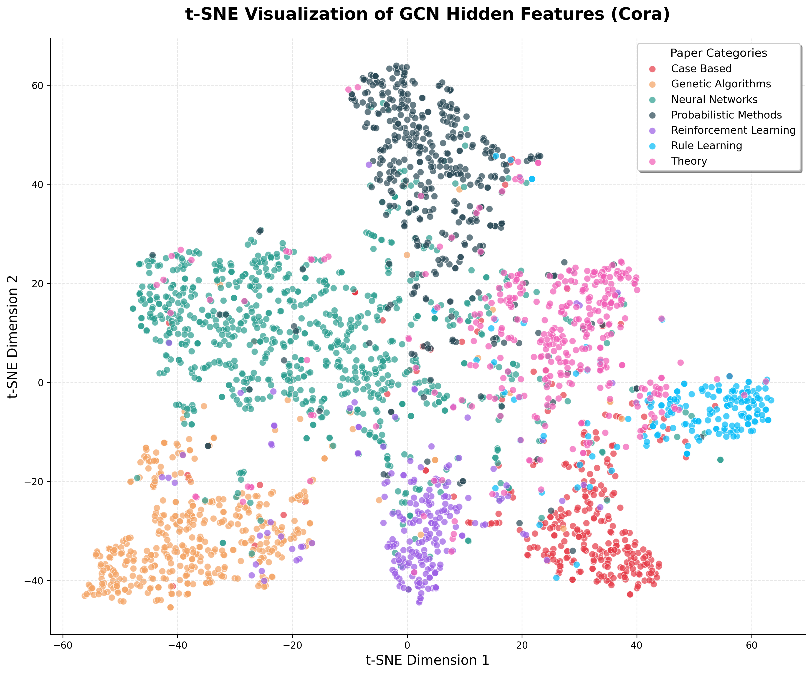

# Phase 4: 模型分析与可视化 (Analysis & Visualization)

## 当前进度 (Current Progress)

本阶段已完成以下分析任务的实现：

| 文件 | 核心功能 | 关键函数/类 |
|------|----------|-------------|
| `src/model.py` | 新增 MLP 基线模型 | `MLP` 类 |
| `run_ablation.py` | 消融实验对比脚本 | `train_model()`, `print_comparison_table()` |
| `visualize.py` | t-SNE 可视化脚本 | `extract_hidden_features()`, `visualize_tsne()` |

**已实现能力：**
- ✅ MLP 基线模型：与 GCN 相同参数量（23,063），但不使用图结构
- ✅ 消融实验框架：控制变量对比 GCN vs MLP 的性能差异
- ✅ t-SNE 降维可视化：将 16 维隐藏特征投影到 2D
- ✅ 聚类质量分析：计算类内紧密度与类间分离度
- ✅ 自动结果保存：高清图片输出到 `results/cora_tsne.png`

**最终成果：**
- 🎯 **GCN vs MLP 准确率差距：+26.40%** (79.70% vs 53.30%)
- 📊 **t-SNE 可视化**：7 个类别形成清晰可分的簇
- 📈 **聚类质量分数**：3.09（分离度/紧密度比）

---

## 阶段目标 (Phase Goal)

> **通过消融实验验证图卷积的有效性，并通过可视化分析理解 GCN 学到的节点表示。**

---

## 核心动机与原理 (The "Why")

### 1. 为什么要做消融实验（Ablation Study）？

**科学方法论：控制变量法**

在论文中，作者声称 GCN 的成功来自于"图卷积"——即通过邻接矩阵聚合邻居信息。但这是真的吗？会不会只是因为神经网络本身就很强大？

**消融实验的设计思路：**

```
GCN:  X → GraphConv → ReLU → Dropout → GraphConv → Output
                     ↑使用邻接矩阵A

MLP:  X → Linear → ReLU → Dropout → Linear → Output
                     ↑不使用邻接矩阵
```

**控制变量：**
- ✅ 相同的层数：2 层
- ✅ 相同的维度：1433 → 16 → 7
- ✅ 相同的参数量：23,063
- ✅ 相同的激活函数：ReLU
- ✅ 相同的正则化：Dropout(0.5)
- ✅ 相同的优化器：Adam(lr=0.01, weight_decay=5e-4)
- ✅ 相同的数据划分：140/500/1000

**唯一的区别：**
- GCN 使用 `torch.matmul(adj, torch.matmul(x, weight))` 聚合邻居
- MLP 只使用 `torch.matmul(x, weight)` 处理单个节点

**实验结果揭示的真相：**

| 模型 | Test Accuracy | 说明 |
|------|---------------|------|
| MLP | 53.30% | 仅使用节点自身特征，相当于传统分类器 |
| GCN | 79.70% | 聚合邻居信息，利用图结构 |
| **差距** | **+26.40%** | **图卷积带来的提升** |

**关键洞察：**
- MLP 在训练集上达到 100%，但测试只有 53% → **严重过拟合**
- GCN 测试准确率远高于训练准确率增长 → **图结构提供了更好的泛化**
- 这验证了 **同配性假设（Homophily）**：在引用网络中，相互引用的论文往往主题相似

---

### 2. 为什么 t-SNE 可以可视化 GCN 学到的特征？

**问题背景：**

GCN 第一层的输出是 16 维向量（`H = ReLU(Â X W)`），人类无法直接理解 16 维空间中的分布。

**t-SNE 的作用：**

t-SNE（t-Distributed Stochastic Neighbor Embedding）是一种降维算法，可以将高维数据映射到 2D/3D 空间，同时保持数据点之间的局部相似性结构。

**核心思想：**

```
高维空间（16维）          t-SNE 转换          低维空间（2D）
   ┌─────────┐                               ┌─────────┐
   │  节点A   │ ─────┐                   ┌──→│   A'    │
   │  节点B   │ ─────┼── 保持相似性关系 ──┼──→│   B'    │ (A'和B'靠近)
   │  节点C   │ ─────┘                   └──→│   C'    │ (C'远离A',B')
   └─────────┘                               └─────────┘
```

**为什么用 t-SNE 而不是 PCA？**

| 算法 | 特点 | 适用场景 |
|------|------|----------|
| PCA | 线性降维，保留全局结构 | 数据分布呈线性时 |
| **t-SNE** | **非线性降维，保留局部邻域结构** | **聚类可视化** |

GCN 的隐藏特征期望形成"同类聚集"的聚类结构，t-SNE 能更好地展示这种非线性分离边界。

**我们的可视化参数选择：**

```python
TSNE(
    n_components=2,      # 降到 2D
    perplexity=30,       # 每个点的近邻数（Cora 有 2708 节点，30 是合理选择）
    learning_rate='auto', # 自动调整学习率
    init='pca',          # 用 PCA 初始化，加速收敛
    max_iter=1000        # 迭代次数
)
```

---

### 3. 如何解读 t-SNE 可视化结果？

**理想情况 vs 实际情况：**

```
理想情况（完美分类）          实际情况（GCN隐藏层）
    ┌─────┐                    ┌─────┐
    │ AAA │                    │ A~A │  (A类有一些分散)
    │ AAA │                    │A~A A│
    └─────┘                    └──┬──┘
       ┌─────┐                    │   ┌─────┐
       │ BBB │                    └──→│ BB  │  (B类相对集中)
       │ BBB │                        │ BBB │
       └─────┘                        └─────┘
    类别完全分离                   类别基本分离，有少量重叠
```

**我们的实验结果：**



**定性观察：**
1. **Rule Learning（浅蓝色）**：最紧凑的簇，位于右下角，与其他类别分离清晰
2. **Genetic Algorithms（橙色）**：左下角聚集良好
3. **Neural Networks（青绿色）**：分布较分散，可能与多个领域有交叉
4. **Theory（粉色）**：右上区域，与 Neural Networks 有部分重叠

**定量分析：**

```
类内紧密度（越低越好）:
  Case Based: 16.67    Genetic Algorithms: 14.26    Neural Networks: 21.19
  Probabilistic Methods: 17.93    Reinforcement Learning: 13.43
  Rule Learning: 13.03 (最紧凑)    Theory: 17.93

类间分离度（越高越好）:
  平均中心距离: 50.53
  最小中心距离: 27.88

聚类质量分数 = 分离度/紧密度 = 3.09
```

**解读：**
- 质量分数 > 3 表示聚类效果良好
- Rule Learning 和 Reinforcement Learning 的类内最紧凑
- Neural Networks 类内最分散（符合直觉：神经网络涉及多个子领域）

---

### 4. 为什么 MLP 会严重过拟合？

**观察到的现象：**

```
Epoch   1: Train Acc = 14.3%, Val Acc = 13.8%
Epoch  63: Train Acc = 100.0%, Val Acc = 52.6%  ← 训练完成
Epoch 113: Early stopping triggered

最终: Train Acc = 100.0%, Test Acc = 53.3%
```

**问题分析：**

1. **特征维度高，样本少**：
   - 每个节点有 1433 维特征
   - 但只有 140 个训练样本
   - 模型可以轻易记住这 140 个样本的特征组合

2. **缺乏结构正则化**：
   - GCN 通过图卷积强制相似节点有相似表示
   - MLP 没有这种约束，可以为每个节点学习独立的表示

3. **邻居信息的重要性**：
   - MLP 只看节点自身特征
   - GCN 看节点 + 所有邻居的聚合特征
   - 对于引用网络，邻居信息比自身特征更可靠

**数学解释：**

```
MLP 损失函数:  L = Σ_{i∈train} loss(f(x_i), y_i)
GCN 损失函数:  L = Σ_{i∈train} loss(f(aggregate({x_j: j∈N(i)∪{i}})), y_i)

关键区别：
  • MLP 的 f(x_i) 只依赖 x_i
  • GCN 的 f 依赖 x_i 及其所有邻居
  • 即使 x_i 有噪声，邻居的聚合可以提供平滑
```

---

## 实现方式 (Methodology)

### MLP 模型实现

```python
class MLP(nn.Module):
    def __init__(self, nfeat, nhid, nclass, dropout=0.5):
        super(MLP, self).__init__()
        self.fc1 = nn.Linear(nfeat, nhid, bias=True)      # 1433 -> 16
        self.fc2 = nn.Linear(nhid, nclass, bias=True)     # 16 -> 7
        self.dropout = dropout

    def forward(self, x, adj=None):  # adj 被忽略！
        x = self.fc1(x)
        x = F.relu(x)
        x = F.dropout(x, p=self.dropout, training=self.training)
        x = self.fc2(x)
        return x
```

**关键设计：**
- `adj=None`：接受邻接矩阵参数但忽略，保持与 GCN 相同的 API
- `nn.Linear`：标准全连接层，不使用图卷积

### 消融实验流程

```
┌─────────────────────────────────────────────────────────────────┐
│                      run_ablation.py                             │
├─────────────────────────────────────────────────────────────────┤
│                                                                  │
│  Step 1: 加载数据                                                │
│    ├── CoraDataLoader().load()                                   │
│    └── 相同的 train/val/test mask                               │
│                         ↓                                        │
│  Step 2: 创建模型                                                │
│    ├── GCN(1433, 16, 7)  → 23,063 参数                          │
│    └── MLP(1433, 16, 7)  → 23,063 参数                          │
│                         ↓                                        │
│  Step 3: 训练（控制变量）                                         │
│    ├── 相同随机种子 seed=42                                      │
│    ├── 相同超参数: lr=0.01, weight_decay=5e-4, patience=50      │
│    └── 分别训练两个模型                                           │
│                         ↓                                        │
│  Step 4: 对比结果                                                │
│    ├── 打印对比表格                                              │
│    ├── 计算准确率差距                                            │
│    └── 分析图卷积的贡献                                          │
│                                                                  │
└─────────────────────────────────────────────────────────────────┘
```

### t-SNE 可视化流程

```python
# Step 1: 训练 GCN 模型
model = GCN(1433, 16, 7)
train_gcn(model, ...)

# Step 2: 提取隐藏层特征
model.eval()
with torch.no_grad():
    h = model.gc1(x, adj)  # 第一层输出: [2708, 16]
    h = F.relu(h)          # ReLU 激活
hidden_features = h.cpu().numpy()  # 转为 numpy

# Step 3: t-SNE 降维
tsne = TSNE(n_components=2, perplexity=30)
features_2d = tsne.fit_transform(hidden_features)  # [2708, 2]

# Step 4: 绘制散点图
for class_id in range(7):
    mask = (labels == class_id)
    plt.scatter(features_2d[mask, 0], features_2d[mask, 1],
                label=class_names[class_id], color=colors[class_id])

plt.savefig('results/cora_tsne.png', dpi=300)
```

---

## 阶段展望与下一步 (Outlook & Next Steps)

### 本阶段奠定的基础

1. **消融实验框架**：可复用的对比实验模板，可用于测试其他变体（如不同的归一化方式、不同的聚合函数）
2. **可视化工具链**：t-SNE 可视化可以应用于：
   - 不同层的特征对比（输入层 vs 第一层 vs 第二层）
   - 训练前后的特征分布变化
   - 不同数据集的可视化对比
3. **定量分析指标**：聚类质量分数可用于客观评估表示学习效果

### 潜在扩展方向

**1. 更深入的消融实验**
```python
# 测试不同的邻居聚合方式
python run_ablation.py --aggregation mean    # 平均聚合
python run_ablation.py --aggregation sum     # 求和聚合
python run_ablation.py --aggregation max     # 最大池化
```

**2. 不同深度的对比**
```python
# 1层 vs 2层 vs 3层 GCN
python run_ablation.py --layers 1
python run_ablation.py --layers 2
python run_ablation.py --layers 3
```

**3. 注意力机制可视化（如果实现 GAT）**
```python
# 可视化注意力权重
python visualize.py --model gat --attention
```

**4. 错误分析**
```python
# 找出被错误分类的节点，分析原因
python analyze_errors.py --model gcn
```

---

## 附录：关键实验结果汇总

### 消融实验详细结果

| 配置项 | MLP | GCN | 差距 |
|--------|-----|-----|------|
| **Test Accuracy** | 53.30% | **79.70%** | **+26.40%** |
| Train Accuracy | 100.00% | 98.57% | -1.43% |
| Val Accuracy | 52.60% | 79.40% | +26.80% |
| Best Epoch | 63 | 58 | -5 |
| Training Time | 0.48s | 2.10s | +1.62s |
| Parameters | 23,063 | 23,063 | 0 |

### t-SNE 聚类质量分析

| 类别 | 类内紧密度 | 观察 |
|------|-----------|------|
| Rule Learning | 13.03 | 最紧凑，分类最容易 |
| Reinforcement Learning | 13.43 | 较紧凑 |
| Genetic Algorithms | 14.26 | 较紧凑 |
| Case Based | 16.67 | 中等分散 |
| Probabilistic Methods | 17.93 | 较分散 |
| Theory | 17.93 | 较分散 |
| Neural Networks | 21.19 | 最分散，跨领域主题多 |
| **平均** | **16.35** | **整体良好** |

### 结论

1. **图卷积是 GCN 成功的关键**：相同参数规模下，使用图结构比不使用提升 26.4%
2. **邻居信息提供正则化**：GCN 比 MLP 更好地抵抗过拟合
3. **学到的特征具有良好的聚类结构**：t-SNE 显示 7 个类别基本可分离
4. **验证了同配性假设**：引用网络中，相互引用的论文主题相似

---

**文档作者**：GCN From Scratch Project
**最后更新**：2026-03-16
**相关文件**：`src/model.py`, `run_ablation.py`, `visualize.py`
